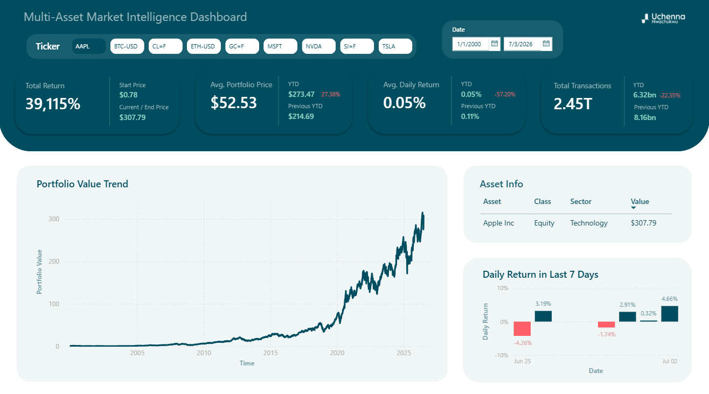
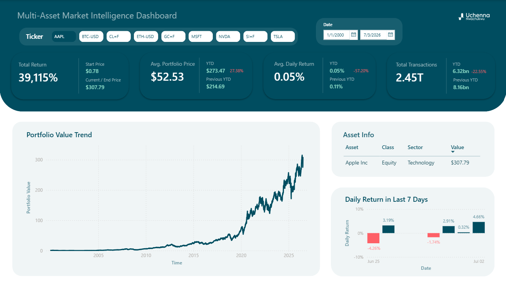
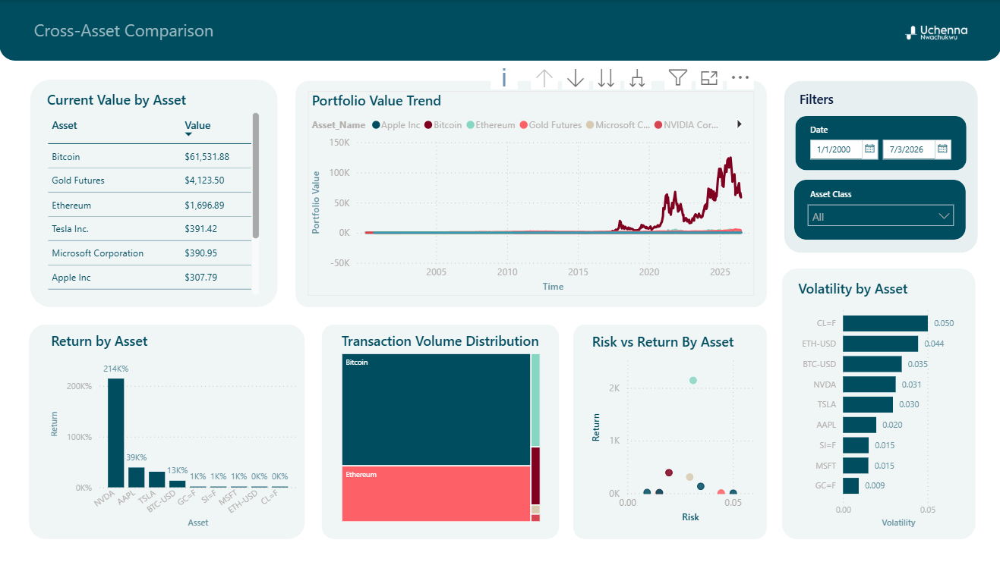

# Multi-Asset Market Intelligence Platform

A real-time financial analytics platform built with Python, GitHub automation, and Power BI to track, analyze, and compare market performance across multiple asset classes including equities, cryptocurrencies, ETFs, and commodities.

This project goes beyond a traditional dashboard by integrating automated data ingestion, cloud-hosted storage, dynamic Power BI reporting, and advanced financial analytics using DAX time intelligence functions.


---


## Live Dashboard Demo

Below is a short interactive preview of the dashboard experience.




---


## Project Overview

The goal of this project was to simulate a lightweight financial intelligence platform capable of:

- Pulling live market data programmatically from Yahoo Finance
- Automating data updates through GitHub workflows
- Building a scalable data pipeline for financial analytics
- Designing interactive dashboards for both single-asset analysis and cross-asset comparison
- Implementing advanced financial metrics such as returns, volatility, and time intelligence calculations

Rather than relying on static datasets, this project uses continuously updating market data, making the dashboard dynamic and production-oriented.


---


## Dashboard Preview

### Page 1: Asset Deep Dive

This page focuses on a single selected asset and provides a detailed view of its historical performance, price behavior, volume trends, and volatility.

Key analytical questions answered:

- How is the selected asset performing over time?
- What is the current price trend?
- What does recent trading behavior look like?
- How volatile is the asset?
- What is the year-to-date performance?

Features:

- Dynamic KPI cards
- Historical price trend analysis
- Trading volume analysis
- Daily return calculations
- Time intelligence metrics (YTD)

Preview:




---


### Page 2: Cross Asset Comparison

This page compares all tracked assets across performance, risk, and return characteristics.

Key analytical questions answered:

- Which assets are performing best?
- Which assets are most volatile?
- How do returns compare across asset classes?
- What relationships exist between assets?
- How do different asset classes behave over time?

Features:

- Cross-asset performance comparison
- Risk vs Return scatter analysis
- Comparative growth visualization
- Volatility comparison
- Asset ranking by return

Preview:




---


## Architecture

The project follows an automated analytics pipeline:

```text
Yahoo Finance API
        ↓
Python ETL Pipeline
        ↓
GitHub Repository Storage
        ↓
Automated Daily Data Refresh
        ↓
Power BI Web Data Connector
        ↓
Interactive Financial Dashboard
```


---


## Tech Stack

### Data Collection

- Python
- Pandas
- yfinance API

### Data Engineering

- Python ETL pipeline
- Automated data extraction scripts
- Data transformation and metadata enrichment

### Automation

- GitHub Actions
- Scheduled workflow automation
- Automated daily dataset refresh

### Analytics & Business Intelligence

- Microsoft Power BI
- DAX Calculations
- Power Query

### Version Control

- Git
- GitHub
- GitHub Codespaces


---


## Project Structure

```text
Multi-Asset-Market-Intelligence/

README.md

market_data.csv

stock_market_pull.py

dashboard/
    Multi-Asset Market Intelligence Dashboard.pbix

images/
    page1.png
    page2.png
    demo.gif
```


---


## Assets Tracked

The dashboard currently tracks multiple financial instruments across several asset classes.

### Equities

- Apple Inc.
- Microsoft Inc.
- NVIDIA Corporation

### Cryptocurrencies

- Bitcoin
- Etherium

### Commodities

- Gold
- Silver
- Crude Oil


---


## Key Metrics Calculated

The dashboard calculates several financial performance and risk indicators.

- Daily Return %
- Year-to-Date (YTD) Return
- Running Return Trend
- Daily Volatility
- Current Price
- Average Trading Volume

### Comparative Metrics

- Asset Performance Ranking
- Risk vs Return Comparison
- Cross-Asset Correlation Analysis


---


## Power BI Features Implemented

The dashboard leverages advanced Power BI functionality including:

- DAX Time Intelligence
- Data Modeling
- Interactive Visualizations


---


## Automation Pipeline

A Python script pulls fresh market data directly from Yahoo Finance and pushes updated data into GitHub.

The Power BI dashboard consumes this data directly from GitHub using the raw CSV URL.

This allows the dashboard dataset to remain continuously updated rather than relying on static exported files.

Pipeline:

```text
Run Python Script
      ↓
Fetch Latest Market Data
      ↓
Generate Updated CSV Dataset
      ↓
Commit to GitHub Repository
      ↓
Power BI Reads Updated CSV
      ↓
Dashboard Refreshes with New Market Data
```


---


## Why This Project Matters

This project was intentionally designed to simulate a real-world analytics workflow by combining:

- Live data ingestion
- Automated refresh pipelines
- Financial market analytics
- Dynamic dashboard reporting
- Time-series and time intelligence analysis

The objective was not simply dashboard development, but building an end-to-end analytics system.


---


## Future Improvements

Potential enhancements include:

- Additional asset coverage
- Portfolio simulation engine
- Sharpe Ratio calculations
- Benchmark analysis against market indices
- Moving average crossover strategy
- Cloud-hosted API layer
- Real-time streaming updates


---


## Repository

Source code, dataset, and dashboard files are contained in this repository.

Main components:

- Python data pipeline (`stock_market_pull.py`)
- Market dataset (`market_data.csv`)
- Power BI dashboard (`dashboard/Multi-Asset Market Intelligence Dashboard.pbix`)
- Dashboard preview assets (`images/`)


---


## Author

Developed by Uchenna Nwachukwu

Focused on building analytics systems that combine data engineering, business intelligence, automation, and decision intelligence.
